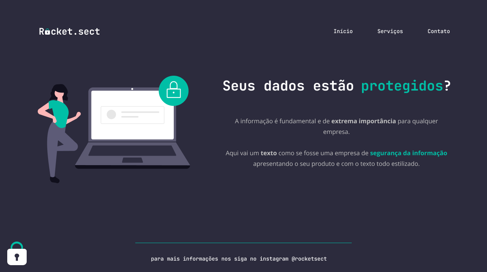

# Desafio avançado - Recriando layout

## 💻 Sobre o desafio

O desafio consiste em recriar uma aplicação, atarvés de um layout, com o intuito de treinar o que aprendi até agora no **Stage 02** do curso Explorer da Rockeseat.

## Figma da aplicação

O figma da aplicação está disponível no [**link**](https://www.figma.com/file/EdKjPWjC8ZlbnH4XzTObv2/Explorer/duplicate) abaixo:

## 🚀 Tecnologias

Esse projeto foi desenvolvido com as seguintes tecnologias:

-HTML
-CSS
